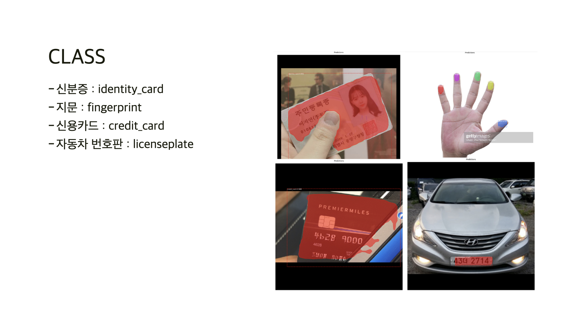
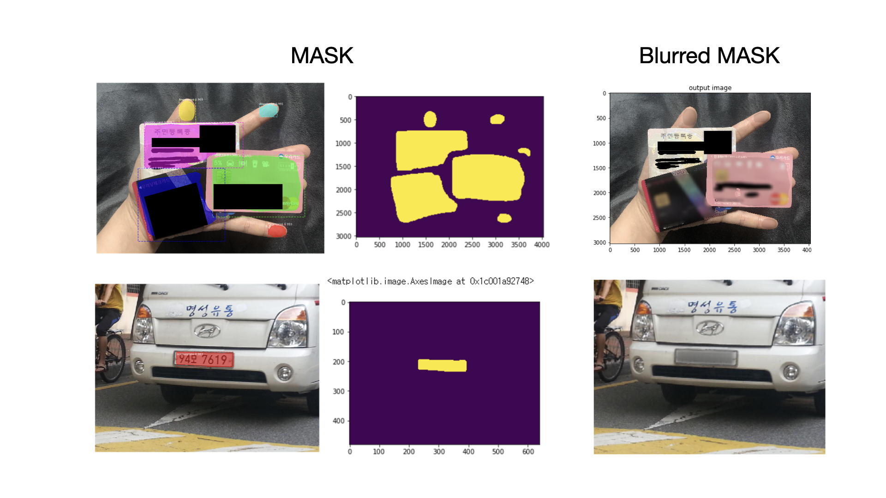

# 민감정보보호 (Sensitive Information Protection)
민감정보인 신분증, 지문, 마그네틱 카드, 자동차 번호판을 이미지에서 블러처리로 가려주기 위한 모델 ([ref code](https://dacon.io/codeshare/1795))

- [MRCNN](https://github.com/matterport/Mask_RCNN/tree/master)으로 학습한 결과
  

